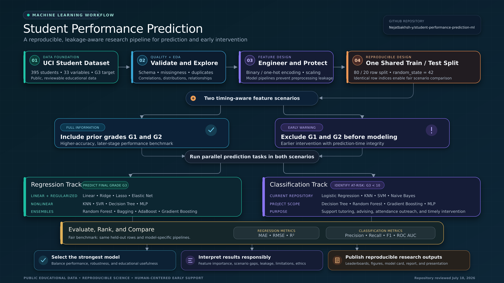

# Student Performance Prediction Using Machine Learning

## Project Overview

This project focuses on predicting student academic performance using machine learning and publicly available educational data. The project introduces a complete research workflow, starting from project orientation and research-question development and ending with a final research poster.

The main goal is to understand which student, family, school, and behavioral factors are related to academic success and to compare different machine learning models for prediction accuracy, interpretation, and practical usefulness.

## Project Purpose

The purposes of this project are:

- To introduce students to applied machine learning research.
- To use public educational data for student performance prediction.
- To define clear research questions and hypotheses.
- To prepare, clean, and explore an educational dataset.
- To train and compare multiple machine learning models.
- To evaluate model performance using appropriate metrics.
- To interpret model results in an educational context.
- To prepare a final research poster summarizing the project.

## Starting Point

The project begins with:

- Understanding the research topic.
- Discussing why student performance prediction is important.
- Reviewing the overall 48-session research plan.
- Setting up the project folder.
- Creating the first `README.md` file.
- Preparing the project environment for future Python work.

## Terminal Point

The terminal point of the project will be a final research poster.

The final poster will summarize:

- The public dataset used in the project.
- The research questions and hypotheses.
- The data-cleaning and feature-preparation steps.
- The machine learning models tested.
- The model evaluation results.
- The main findings and conclusions.
- The educational meaning of the results.

## Public Data

This project will use publicly available educational data. Public data allows the research workflow to be shared, reviewed, repeated, and improved by others.

Using public data also helps students learn how to work with real-world datasets while avoiding private or confidential student records.

## Planned Outputs

The final project will include:

- Cleaned dataset
- Exploratory data analysis
- Feature engineering
- Model training notebooks
- Model comparison results
- Evaluation metrics
- Feature-importance or interpretation results
- Final research poster
- Reproducible project documentation

## Program Structure

This project is designed for a 48-session research program.

```text
48 sessions x 2 hours = 96 total hours
```

## Tools

The project will use:

- Python
- Google Colab
- Visual Studio Code
- pandas
- numpy
- matplotlib
- seaborn
- scikit-learn

## Session 1: Project Orientation and Research Goals

### Session 1 Objective

The objective of Session 1 is to introduce the project, explain the purpose of student performance prediction, and create the first project documentation file.

### Python Task

Students will run a simple Python banner in Google Colab to confirm that the environment works.

```python
project = "Student Performance Prediction Using Machine Learning"
weeks = 4
sessions = 48
hours = sessions * 2

print(project)
print(f"{sessions} sessions x 2 hours = {hours} total hours")
```

### Student Activity

Students will work in pairs and write one sentence describing what they personally hope to learn from the project. Each sentence will be connected to one of the project research questions.

### Output Artifact

The main artifact for Session 1 is a one-page project overview note saved to the shared drive.

### Reflection Question

Why is asking which algorithm performs best a stronger research question than asking only whether machine learning can predict performance?

### GitHub Deliverable

The GitHub deliverable for Session 1 is a project folder with a draft `README.md` file containing the project title, overview, purpose, starting point, terminal point, and planned outputs.

## Project Status

Current status:

```text
Session 1 completed: Project orientation and initial README created.
```
## Project Logic Flowchart

