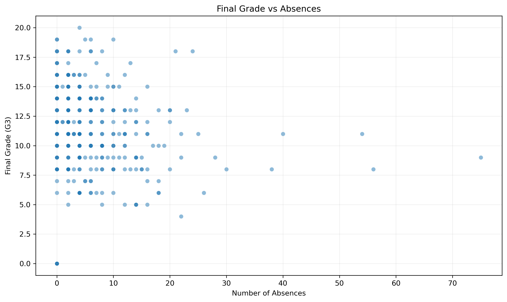

<!-- SESSION_15_START -->
## Session 15: Attendance, Past Failures, and Final Grade

### Variables Examined

- **failures:** Number of past class failures
- **absences:** Number of school absences
- **studytime:** Weekly study-time category
- **G3:** Final grade

### Data Used

- Dataset: **data/student-mat.csv**
- Complete observations analyzed: **395**

### Past Failures and Final Grade

- Mean G3 for students with 0 failures: **11.25**
- Mean G3 for students with 1 failure: **8.12**
- Mean G3 for students with 2 failures: **6.24**
- Mean G3 for students with 3 or more failures: **5.69**
- Correlation between failures and G3: **-0.360**

The grouped results indicate that past failures are associated with final-grade performance. This is an observational association and does not establish that previous failures directly cause a student's current grade.

### Absences and Final Grade

The scatterplot showed a **weak positive** relationship. Students with higher absence counts generally tended to have **higher** final grades, but the observations contained variation and overlap.

- Correlation between absences and G3: **0.034**

Students with similar absence counts may still receive different final grades. Absences should therefore not be used alone to predict performance.

### Study Time and Final Grade

- Correlation between study time and G3: **0.098**

Study time provides additional context, but it should be interpreted together with failures, absences, grouped averages, and the reliability of self-reported study behavior.

### Ranked Features by Apparent Predictive Strength

1. **Past failures**
2. **Study time**
3. **Absences**

This exploratory ranking is based on absolute correlations and is interpreted together with the grouped means and scatterplot.

### Early-Warning Interpretation

Past failures can serve as a baseline risk indicator because they are normally available before or at the beginning of a term. Absences can be monitored during the term as a changing warning signal. Study time may provide supporting contextual information.

These variables should be combined with other appropriate predictors and used to guide tutoring, advising, attendance outreach, or other academic support rather than automatic penalties.

### Figure

### Limitation

These findings describe associations rather than causal effects. Failure-group sizes may differ, the scatterplot may include outliers, and substantial overlap may exist between students. Formal model training and validation are required before operational use.
<!-- SESSION_15_END -->
