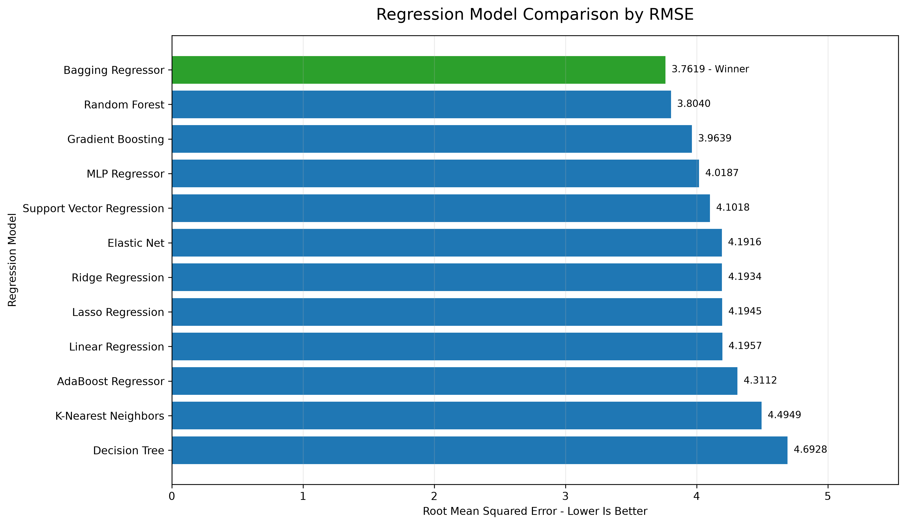
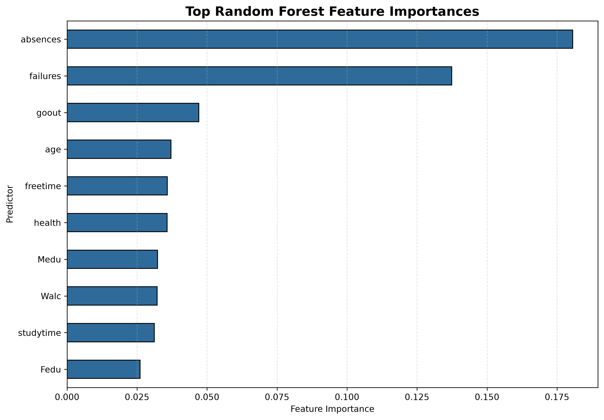

# Predicting Student Academic Success Using Interpretable Machine Learning

## Abstract

This study evaluates interpretable machine-learning methods for predicting student academic success with public educational data. The project compares regression models for a continuous academic outcome and classification models for an academic-success category. All models are evaluated with saved, reproducible leaderboards and a consistent preprocessing and data-splitting workflow. The strongest regression result was produced by Bagging Regressor, with RMSE of 3.761939. The strongest classification result was produced by SVM, with F1 of 0.8785046728971962. These results show the value of systematic model comparison while emphasizing that predictions should support timely educational assistance rather than labeling, punishment, or surveillance.

## Introduction

Identifying students who may benefit from additional academic support is an important educational objective. Machine learning can help summarize patterns in student-performance data, but predictive accuracy alone is not sufficient. Models must also be interpretable, reproducible, checked for leakage, and used responsibly. This project therefore compares several regression and classification approaches, examines their performance with appropriate metrics, and considers how early-warning predictions can be used to support constructive intervention.

## Data

The analysis uses the public student-performance data maintained in this repository. The saved notebooks and source files document the predictor variables, target construction, data cleaning, missing-value handling, and preprocessing operations. The project also distinguishes a full-feature setting from an early-warning setting that excludes later-grade information such as G1 and G2 when those values would not be available at the intended decision time. This separation reduces leakage and makes the early-warning comparison more educationally realistic.

## Methods

The regression comparison includes AdaBoost Regressor, Bagging Regressor, Decision Tree, Elastic Net, Gradient Boosting, K-Nearest Neighbors, Lasso Regression, Linear Regression, MLP Regressor, Random Forest, Ridge Regression, Support Vector Regression. The classification comparison includes AdaBoost, GradBoost, KNN, Logistic Regression, logistic_metrics, NB, SVM. The repository applies consistent train-test partitions and preprocessing pipelines so that model comparisons use the same observations and feature definitions. Regression performance is summarized with error and goodness-of-fit metrics, including MAE, RMSE, and R2 when available. Classification performance is summarized with accuracy, precision, recall, F1, and ROC AUC when available. Cross-validation, tuning, and interpretability outputs are used where they are available in the repository.

## Results

### Regression Results

The regression leaderboard contains 12 evaluated model rows. Based on RMSE, the strongest regression model was Bagging Regressor, with MAE = 2.988734, RMSE = 3.761939, R2 = 0.309820. These values come directly from regression_leaderboard.csv and were not estimated or invented during report generation.

### Classification Results

The classification leaderboard contains 7 evaluated model rows. Based on F1, the strongest classifier was SVM, with Accuracy = 0.8354430379746836, Precision = 0.7916666666666666, Recall = 0.903846153846154, F1 = 0.8785046728971962, ROC AUC = 0.9387464387464388. These values come directly from classification_leaderboard.csv and were not estimated or invented during report generation.

### Main Finding

The central result is that model selection depends on both the prediction task and the evaluation metric. Bagging Regressor provides the strongest saved regression result, whereas SVM provides the strongest saved classification result. The leaderboards provide the quantitative evidence for these conclusions and allow the comparisons to be reproduced.

## Interpretation

The results should be interpreted as evidence about predictive patterns in this dataset rather than as fixed judgments about individual students. Model rankings can change when the feature set, split, validation procedure, or metric changes. Feature-importance evidence can help identify influential predictors, but importance does not establish causation. The early-warning analysis is especially important because a slightly less accurate leakage-aware model may be more useful and responsible at the time an intervention decision must be made.

## Limitations

The findings are limited by the size, composition, and historical context of the public dataset. Performance may not generalize to other schools, student populations, curricula, or time periods. Observed associations can reflect unmeasured social and institutional factors, and model outputs may reproduce existing inequities. Later-grade predictors can create leakage when used for early-warning decisions. Metric uncertainty, correlated predictors, and differences across train-test splits also affect interpretation. Additional external validation and fairness analysis are required before operational use.

## Conclusion

This project compared multiple machine-learning approaches for student-success prediction using reproducible regression and classification leaderboards. The best saved regression result was Bagging Regressor, with RMSE of 3.761939, while the best saved classification result was SVM, with F1 of 0.8785046728971962. These results demonstrate the value of comparing models with task-appropriate metrics and leakage-aware features. Any practical use should focus on offering timely academic resources and supportive intervention, never surveillance, punishment, or permanent labeling.

## References

- Public student-performance dataset documentation used by this repository.
- Pedregosa, F. et al. Scikit-learn: Machine Learning in Python.
- pandas development team. pandas documentation.
- Project notebooks, source code, leaderboard CSV files, and saved figures in this repository.
