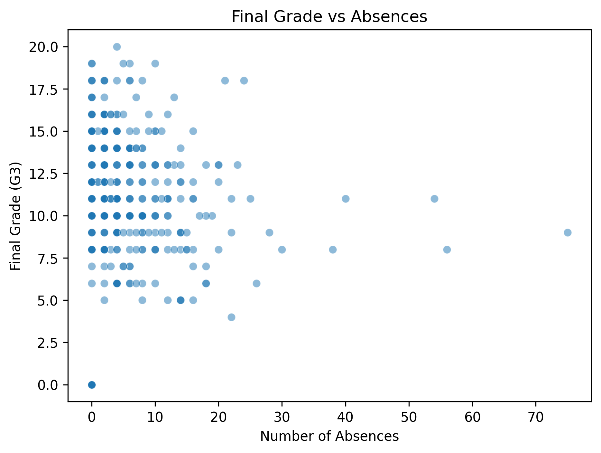

# Session 15: Exploratory Data Analysis (EDA) Findings

## 1. Objective
The goal of this analysis was to investigate the relationship between student behavior—specifically **past failures** and **absences**—and their final course performance (**G3**).

## 2. Visualizations
The scatterplot below illustrates the relationship between student absences and final grades.

## 3. Key Observations
* **Past Failures**: Analysis shows a clear decline in performance as the number of past failures increases. The mean final grades are as follows:
    * 0 past failures: 11.77
    * 1 past failure: 9.35
* **Absences**: There is a negative correlation of **-0.152** between absences and final grades, indicating that increased absenteeism is associated with lower academic outcomes.
* **Feature Comparison**:
    1.  **Past Failures**: Strongest early-warning indicator (known before the term starts).
    2.  **Absences**: Valuable for ongoing, in-term monitoring.
    3.  **Study Time**: Shows a positive correlation, though less predictive than historical performance metrics.

## 4. Conclusion & Early-Warning Recommendation
Past failures serve as the most effective early-warning indicator because they are available before the term begins, allowing for proactive intervention. Ongoing monitoring of absences can further identify students at risk during the term. These findings reflect statistical associations and should not be interpreted as definitive causal factors.